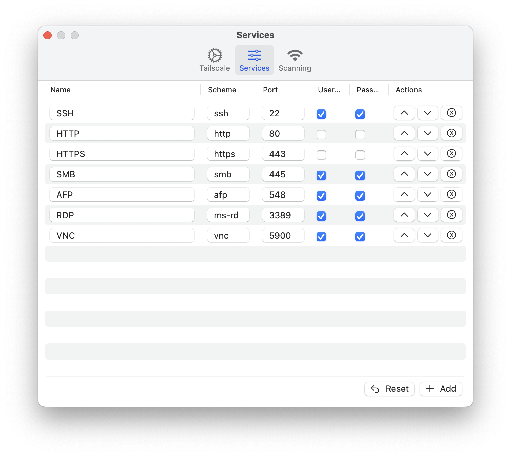
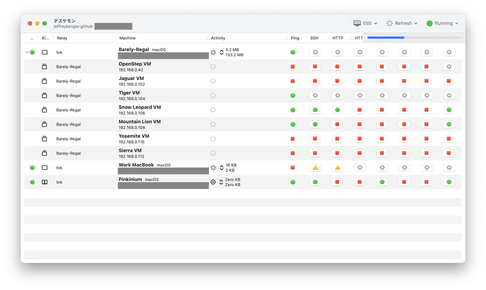

# テスケモン・Teskemon
## テールスケール専門・Tailscale Specialist

### Background
Teskemon is a SwiftUI application built to monitor Tailscale networks. 
It is provided under the [GPLv3 open source license](LICENSE) and without any warranty or liability. 
If this application is useful for you, please use as you wish and provide feedback. 
And yes, I do accept pull requests.

### Download

- Requires macOS 14.4 or later
- [Download the Latest Notarized Build](Builds/Current.zip)

Requires macOS 14.4 because of `TableColumnForEach`. This is the
the only reasonable way to make dynamic Table Columns based on user set data. 
This is how I show 1 column for each Service that is set in Settings.

### Features
1. Uses the Tailscale CLI to Find All the Machines in Your Tailnet
1. "Explodes" the Subnet Routes into Children Machines
1. Uses netcat (nc) to Port Scan a Set of Services
1. Uses ping to Ping Each Machine
1. Services are Customizable (optional)
1. Click on a Service Status for a Machine to Open that URL
1. Securely Stores Passwords for Machines to Include in URL in Keychain
1. Customize the Names of Machines for Display in the Table (optional)

### Known Issues
1. Links for RDP do not work - in classic Microsoft fashion, the URL scheme for `rdp://` and `ms-rd://` is not typical
1. There are no keyboard shortcuts or menu commands yet
1. Errors in Ping and Netcat scanning are not reported to the user
1. Exit Node status for a Machine is not displayed yet
1. The icon is crap - I made it in 15 minutes using [Icon Kitchen](https://icon.kitchen). It could definitely be improved.

### Privacy
Teskemon does not access the internet or use any analytics service. There is no 
login or other user information stored. The tailscale CLI does provide your 
name, but it is only stored in SceneStorage and never uploaded anywhere. 
Passwords are stored in the keychain but they are cached in memory 
for performance reasons.

That said, Teskemon is not sandboxed because it uses the Process API 
(previously NSTask). Because Process allows the application to run any executable 
on the machine, it is not possible to use this API in a sandboxed application. 
Process is only used to run netcat, ping, and the Tailscale CLI. 

Also, if your employer tightly monitors their network, using Netcat 
to port scan a large number of ports on a large number of machines can cause 
warnings to go off (ask how I know). In those cases you may want to disable 
automatic refresh of Services, which is the default setting.

### Development Approach
Teskemon uses a standard Model View Controller approach. 
There are 3 Swift Packages, Model, Controller, View. When I make big changes 
I usually post about it on Mastodon. 
Following along [jeffburg.social/tags/Tailscale](https://jeffburg.social/tags/Tailscale) 
if you are curious.

#### Model
Contains all the basic model types and the conversion logic from the JSON
provided by Tailscale `tailscale status --json`. These types can all be
considered View Models if you like... they are all meant for the view.

#### Controller
Controller contains 3 sets of functionality:
1. Keychain access logic
1. Extension to Process (previously NSTask) to execute the CLI commands
and parse the results. This is all done using `async await`
1. Property Wrappers that wrap the model complexity as well as the Keychain, 
Process, and Presentation complexity into simple types the views can read from
and write to

In order to ensure consistency and live updating across all screens all the time 
either AppStorage or SceneStorage are used as an underlying storage primitive. 
AppStorage stores settings like custom names and the list of services. 
SceneStorage stores temporary information like the list of Machines from Tailscale,
the results of the Service scans, and the presentation state of all the views.

#### View
This layer contains all of the views for the application. They are all fairly
simply and mostly consist of Tables or Forms.

### Questions? Feedback?
Please create an issue on this project. Sorry, I can't promise much in terms 
of support. Please keep discussion polite.

### Contributions?
Yes please. Please keep discussion polite.

### More Screenshots

